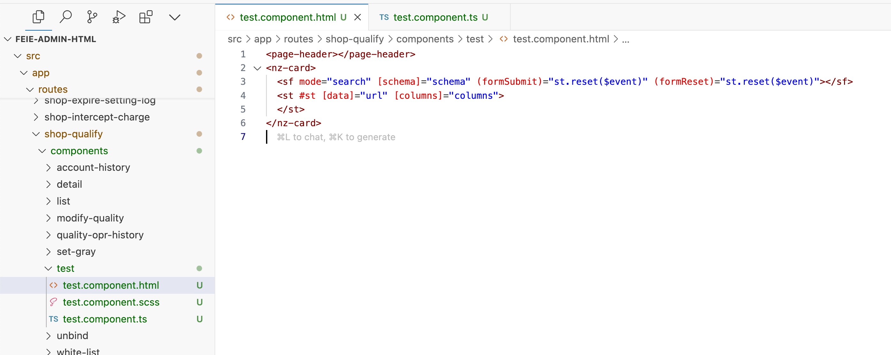

# angular-template-generate README

这是一个快速生成 angular 常规模版的插件,你的 angular 文件创建帕鲁

暂未发布到商店，可直接使用打包后文件安装，安装方式-使用快捷键 Ctrl+Shift+P（在 macOS 上为 Cmd+Shift+P），然后输入 Extensions: Install from VSIX ，选择此项目 build 后生成的文件

# 如何使用😄:

用法1: 安装插件后文件树将会增加一个菜单栏选项，根据输入指引即可快速创建 angular 模块/组件的基本模版
 

用法2:代码块处将增加菜单栏,可用于创建常用代码逻辑

# delon 表单/表格生成组件数据规则

, 分割对象属性 
; 分割每个 item 对象 
| 分割每个枚举 

目前支持生成 
 -表单组件 
 -表格组件 
 -表单表格组件 
 -Angular 模块（包含子路由模块） 

# 详细用法
如根据指引输入数据 **"测试1,test1,select,选项1,0|选项2,1;"** 和 **"测试2，test2”与“列1，column1；列2，column2"** 即可生成如下组件并**自动添加声明到离其最近的模块**  
输入

生成结果

# 弹窗
在代码块处点击右键可以一键创建弹窗，输入希望的自定义模版名即可，**相关的服务及 Angular 模块无需编写，插件会自动检测并自动声明依赖到代码中的各个位置**

